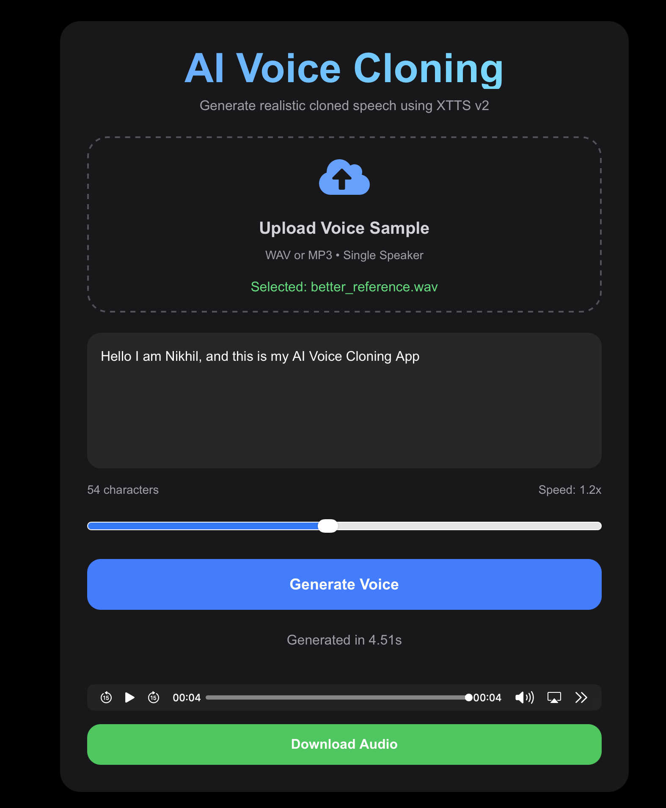

# AI Voice Cloning App

A full-stack AI Voice Cloning Web Application built using:

- FastAPI
- Next.js
- React
- XTTS v2 (Coqui TTS)
- PyTorch
- Tailwind CSS

The application allows users to:

- Upload a voice sample
- Enter custom text
- Generate cloned speech using XTTS v2
- Play generated audio
- Download generated audio files

---

# Features

## Backend (FastAPI)

- Audio upload API
- Voice generation API
- Audio streaming endpoint
- XTTS v2 integration
- Audio preprocessing with FFmpeg
- File validation
- FastAPI Swagger documentation

## Frontend (Next.js)

- Modern dark-themed UI
- Audio file upload
- Custom text input
- Voice generation button
- Audio playback
- Audio download support

---

# Tech Stack

## Frontend

- Next.js
- React
- TypeScript
- Tailwind CSS
- Axios

## Backend

- FastAPI
- Python 3.11
- Coqui TTS
- XTTS v2
- Torch
- Torchaudio
- FFmpeg
- Uvicorn

---

# Project Structure

```text
voice-cloning-app/
│
├── backend/
│   ├── app/
│   │   ├── routes/
│   │   ├── services/
│   │   ├── utils/
│   │   ├── uploads/
│   │   └── outputs/
│   │
│   └── requirements.txt
│
├── frontend/
│   ├── src/
│   │   ├── app/
│   │   ├── components/
│   │   └── services/
│
└── README.md
```

---

# Installation

## Clone Repository

```bash
git clone https://github.com/Delta369963/AI-Voice-Cloning.git
```

---

# Backend Setup

## Enter Backend

```bash
cd voice-cloning-app/backend
```

## Create Virtual Environment

```bash
python3 -m venv venv
```

## Activate Virtual Environment

### macOS/Linux

```bash
source venv/bin/activate
```

---

## Install Dependencies

```bash
pip install -r requirements.txt
```

---

## Run Backend Server

```bash
python3 -m uvicorn app.main:app --reload
```

Backend runs on:

```text
http://127.0.0.1:8000
```

Swagger Docs:

```text
http://127.0.0.1:8000/docs
```

---

# Frontend Setup

## Enter Frontend

```bash
cd ../frontend
```

## Install Dependencies

```bash
npm install
```

---

## Run Frontend

```bash
npm run dev
```

Frontend runs on:

```text
http://localhost:3000
```

---

# API Endpoints

## Upload Audio

```http
POST /upload
```

Uploads WAV or MP3 reference audio.

---

## Generate Voice

```http
POST /generate
```

Generates cloned speech using XTTS v2.

Request Example:

```json
{
  "text": "Hello from AI voice cloning.",
  "filename": "reference.wav",
  "speed": 1.2
}
```

---

## Stream Generated Audio

```http
GET /audio/{filename}
```

Streams generated audio files.

---

# Voice Cloning Flow

```text
Upload Audio
      ↓
Store Reference File
      ↓
XTTS v2 Processes Speaker Voice
      ↓
Generate Speech From Text
      ↓
Save Generated WAV
      ↓
Frontend Playback & Download
```

---

# Notes

- Authentication is NOT implemented yet.
- Generated audio files are stored locally.
- Uploads are temporary local files.
- Optimised for Apple Silicon (M-series Macs).
- XTTS model is preloaded for faster inference.

---

# Future Improvements

- User authentication
- Database integration
- Voice history
- Real-time generation progress
- Streaming inference
- Docker support
- Cloud deployment
- Multi-language support
- Emotion control

---

# Screenshots



---

# License

This project is for educational and personal use.